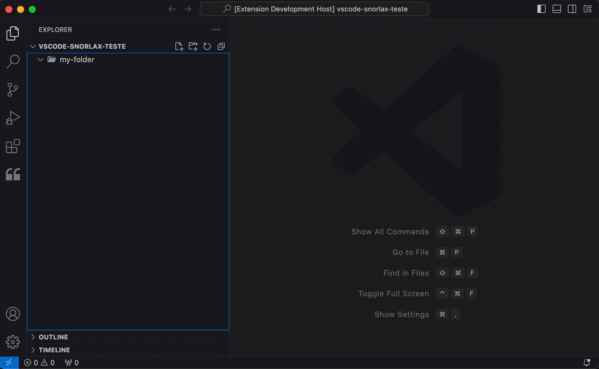

# Gerador de Arquivos Personalizado

Caso você queira personalizar os arquivos que são gerados juntamente com seus snippets ao clicar em determinada opção do Snorlax, basta seguir essa documentação.

### 1. Altere o arquivo de Snippet da Linguagem

Nesse exemplo, alteramos o arquivo `snorlax-react-native.code-snippets` pois iremos alterar a geração de arquivos da linguagem "React-Native". O objetivo desse exemplo é que ao clicar na opção "Criar componente", eu consiga criar arquivos personalizados. (Nesse exemplo, vamos criar um arquivo de storybook para teste).

Aqui um exemplo de como personalizar o seu `snorlax-react-native.code-snippets`:

```json
{
	"exemple-create-styles": {
		"prefix": "exemple-create-styles",
		"scope": "typescript",
		"body": [
			"// My styles file."
		]
	},
	"exemple-create-screen": {
		"prefix": "exemple-create-screen",
		"scope": "typescriptreact",
		"body": [
			"// My screen file."
		]
	},
	"exemple-create-component": {
		"prefix": "exemple-create-component",
		"scope": "typescriptreact",
		"body": [
			"// My component file."
		]
	},
	"exemple-create-component-props": {
		"prefix": "exemple-create-component-props",
		"scope": "typescript",
		"body": [
			"// My component props file."
		]
	},
  "exemple-create-storybook-file": {
		"prefix": "exemple-create-storybook-file",
		"scope": "typescript",
		"body": [
			"// My storybook file."
		]
	}
}
```

Perceba que nesse exemplo, colocamos prefixos customizados para criar códigos personalizados com destaque para o `exemple-create-storybook-file`. Por padrão, o Snorlax não cria um arquivo de teste para react native usando o storybook, porém vamos adicionar uma configuração que cria esse arquivo ao clicar em "Criar componente".

### 2. Altere o seu settings.json

Adicione a seguinte configuração no arquivo `settings.json` abaixo para criar arquivos de forma personalizada: 

```json
{
  "snorlax.generator": {
    "react-native": {
      "createComponent": {
        "files": [
          {
            "file": "index",
            "extension": "tsx",
            "snippet": "exemple-create-component"
          },
          {
            "file": "styles",
            "extension": "ts",
            "snippet": "exemple-create-styles"
          },
          {
            "file": "types",
            "extension": ".d.ts",
            "snippet": "exemple-create-component-props"
          },
          {
            "file": "index",
            "extension": ".stories.tsx",
            "snippet": "exemple-create-storybook-file"
          },
        ]
      },
		}
  }
}
```

Dessa forma, ao clicar em Snorlax -> React-Native -> Criar componente, o Snorlax irá criar os 4 arquivos configurados no `settings.json` com os snippets personalizados criados em `snorlax-react-native.code-snippets`.

<div align="center" >
  
</div>
